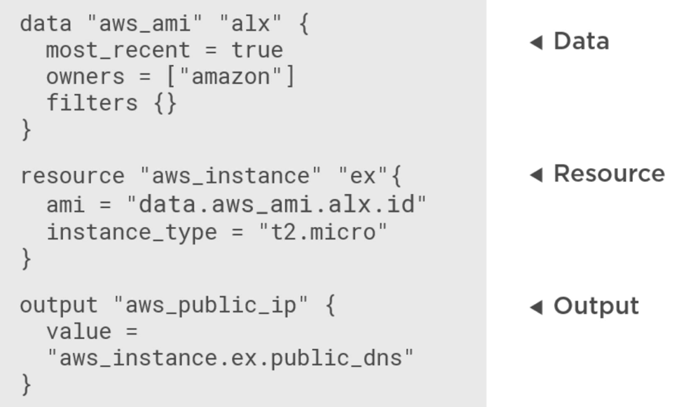

# Curso Terraform (Pluralsight)

Apuntes del curso de [Terraform de Pluralsight by Ned Bellavance](https://app.pluralsight.com/library/courses/getting-started-terraform/table-of-contents). En el [Repositorio](https://github.com/ned1313/Getting-Started-Terraform) están los ficheros del curso.

## Terraform

Se usa un sistema de condiguración *declarativo* (como Kubernetes) en lugar de *imperativo*. El sistema es **indempotente** y *consistente*. Terraform usa un sistema *Push* dado que envía la configuración al sistema destino.
> **Indempotente** es cuando una operación puede ser repetida tantas veces como sea necesario sin causar efectos involuntarios. No tiene efecto sobre el sistema repetir la misma operación varias veces.

Es idel hacer una separación de ficheros con al menos:

1. Un fichero con el plan (.tf)
1. Un fichero con las variables (terraform.tfvars)
1. Un fichero con las salidas (outputs.tf)

Terraform combina todos los fichero **tf** como si fueran uno solo.

Tras desplegar un *plan* sobre una infraestructura, Terraform pierde el control de la máquina. Para este control, se recomienda usar herramientas como **chef** o **puppet** y como último recurso [Provisioners](provisioners.md)

* [Sintaxis de Terraform](syntax.md)
* [Funciones y Providers](funciones-providers.md)
* [Comandos](comandos.md)
* [Providers](providers.md)
* [Variables](variables.md)
* [Trabajar con entornos (Workspaces)](entornos.md)
* [Secrets](secrets.md)
* [Modulos](modulos.md)
* [Importar](importar.md)
* [Backends](backends.md)
* [Custom Data Sources y Templates](data-sources-and-templates.md)

## Beneficios de usar **IaC**

* Despliegues automatizados
* Entornos consistentes
* Proceso repetible
* Componentes reutilizables
* Arquitectura documentada

## Componentes de Terraform

* Una aplicación cliente [Terraform download](https://www.terraform.io/downloads.html)
* Uno o mas ficheros *Terraform files* (xxxxx.tf)
* Plugins. Terraform usa plugins para hablar con proveedores como AWS o GCE
* [Fichero de estado](terraform-state.md). Se usa para saber el estado de lo que se ha desplegado

## Configuración

Se hace uso de variables para definir los datos que necesita Terraform, por ejemplo, para hablar con el proveedor.


## Elementos de trabajo

|Tipo|Descripción|
|---|---|
|Data|Define un objeto que luego podemos usar. Zonas, Regiones, etc. En el ejemplo images de servidores de AWS|
|Resources|Recursos que queremos definir. VMs, etc|
|Output|Datos que queremos obtener de una ejecución|



## Ejecutar el terraform

Tenemos que estar en la carpeta donde tenemos el fichero de configuración de Terraform a ejecutar.

```bash
terraform init # Esto examina el fichero e instala el plugin de AWS al ver que está en uso
terraform plan -out plan.tfplan  # Se genera el fichero con el plan que se tiene que ejecutar para completar la configuración
terraform apply plan.tfplan  # Ejecuta el plan generado
terraform destroy   # Esto borra lo que se generó con el plan y pide confirmaciónclear
```

### Salida del comando **terraform plan**

Terraform genera un plan basándose en el estado actual contra el estado que queremos tener. Crea un gráfico de dependencias que permite crear los recursos en el orden correcto. La salida es un plan con las adiciones, actualizaciones o borrados a ejecutar. El plan se genera de manera que si es posible, se pueda ejecutar en paralelo. Por último se genera un fichero con el plan. Esto permite que un proceso de despliegue se pueda validar y autorizar dicho plan antes de ser ejecutado.

```bash
terraform plan -out plan.tfplan                                                                     git:(master|✚1… 
Refreshing Terraform state in-memory prior to plan...
The refreshed state will be used to calculate this plan, but will not be
persisted to local or remote state storage.

data.aws_ami.aws-linux: Refreshing state...

------------------------------------------------------------------------

An execution plan has been generated and is shown below.
Resource actions are indicated with the following symbols:
  + create

Terraform will perform the following actions:

  # aws_default_vpc.default will be created
  + resource "aws_default_vpc" "default" {
      + arn                              = (known after apply)
      + assign_generated_ipv6_cidr_block = (known after apply)
      + cidr_block                       = (known after apply)
      + default_network_acl_id           = (known after apply)
      + default_route_table_id           = (known after apply)
      + default_security_group_id        = (known after apply)
      + dhcp_options_id                  = (known after apply)
      + enable_classiclink               = (known after apply)
      + enable_classiclink_dns_support   = (known after apply)
      + enable_dns_hostnames             = (known after apply)
      + enable_dns_support               = true
      + id                               = (known after apply)
      + instance_tenancy                 = (known after apply)
      + ipv6_association_id              = (known after apply)
      + ipv6_cidr_block                  = (known after apply)
      + main_route_table_id              = (known after apply)
      + owner_id                         = (known after apply)
    }

  # aws_instance.nginx will be created
  + resource "aws_instance" "nginx" {
      + ami                          = "ami-00890f614e48ce866"
      + arn                          = (known after apply)
      + associate_public_ip_address  = (known after apply)
      + availability_zone            = (known after apply)
      + cpu_core_count               = (known after apply)
      + cpu_threads_per_core         = (known after apply)
      + get_password_data            = false
      + host_id                      = (known after apply)
      + id                           = (known after apply)
      + instance_state               = (known after apply)
      + instance_type                = "t2.micro"
      + ipv6_address_count           = (known after apply)
      + ipv6_addresses               = (known after apply)
      + key_name                     = "demo_terraform"
      + network_interface_id         = (known after apply)
      + password_data                = (known after apply)
      + placement_group              = (known after apply)
      + primary_network_interface_id = (known after apply)
      + private_dns                  = (known after apply)
      + private_ip                   = (known after apply)
      + public_dns                   = (known after apply)
      + public_ip                    = (known after apply)
      + security_groups              = (known after apply)
      + source_dest_check            = true
      + subnet_id                    = (known after apply)
      + tenancy                      = (known after apply)
      + volume_tags                  = (known after apply)
      + vpc_security_group_ids       = (known after apply)

      + ebs_block_device {
          + delete_on_termination = (known after apply)
          + device_name           = (known after apply)
          + encrypted             = (known after apply)
          + iops                  = (known after apply)
          + kms_key_id            = (known after apply)
          + snapshot_id           = (known after apply)
          + volume_id             = (known after apply)
          + volume_size           = (known after apply)
          + volume_type           = (known after apply)
        }

      + ephemeral_block_device {
          + device_name  = (known after apply)
          + no_device    = (known after apply)
          + virtual_name = (known after apply)
        }

      + metadata_options {
          + http_endpoint               = (known after apply)
          + http_put_response_hop_limit = (known after apply)
          + http_tokens                 = (known after apply)
        }

      + network_interface {
          + delete_on_termination = (known after apply)
          + device_index          = (known after apply)
          + network_interface_id  = (known after apply)
        }

      + root_block_device {
          + delete_on_termination = (known after apply)
          + device_name           = (known after apply)
          + encrypted             = (known after apply)
          + iops                  = (known after apply)
          + kms_key_id            = (known after apply)
          + volume_id             = (known after apply)
          + volume_size           = (known after apply)
          + volume_type           = (known after apply)
        }
    }

  # aws_security_group.allow_ssh will be created
  + resource "aws_security_group" "allow_ssh" {
      + arn                    = (known after apply)
      + description            = "Allow ports for nginx demo"
      + egress                 = [
          + {
              + cidr_blocks      = [
                  + "0.0.0.0/0",
                ]
              + description      = ""
              + from_port        = 0
              + ipv6_cidr_blocks = []
              + prefix_list_ids  = []
              + protocol         = "-1"
              + security_groups  = []
              + self             = false
              + to_port          = 0
            },
        ]
      + id                     = (known after apply)
      + ingress                = [
          + {
              + cidr_blocks      = [
                  + "0.0.0.0/0",
                ]
              + description      = ""
              + from_port        = 22
              + ipv6_cidr_blocks = []
              + prefix_list_ids  = []
              + protocol         = "tcp"
              + security_groups  = []
              + self             = false
              + to_port          = 22
            },
          + {
              + cidr_blocks      = [
                  + "0.0.0.0/0",
                ]
              + description      = ""
              + from_port        = 80
              + ipv6_cidr_blocks = []
              + prefix_list_ids  = []
              + protocol         = "tcp"
              + security_groups  = []
              + self             = false
              + to_port          = 80
            },
        ]
      + name                   = "nginx_demo"
      + owner_id               = (known after apply)
      + revoke_rules_on_delete = false
      + vpc_id                 = (known after apply)
    }

Plan: 3 to add, 0 to change, 0 to destroy.

------------------------------------------------------------------------

This plan was saved to: plan.tfplan

To perform exactly these actions, run the following command to apply:
    terraform apply "plan.tfplan"
```

### Salida del comando **terrafrom apply**

```bash
terraform apply plan.tfplan                                                                         git:(master|✚1… 
aws_instance.nginx: Creating...
aws_instance.nginx: Still creating... [10s elapsed]
aws_instance.nginx: Still creating... [20s elapsed]
aws_instance.nginx: Provisioning with 'remote-exec'...
aws_instance.nginx (remote-exec): Connecting to remote host via SSH...
aws_instance.nginx (remote-exec):   Host: 34.254.232.106
aws_instance.nginx (remote-exec):   User: ec2-user
aws_instance.nginx (remote-exec):   Password: false
aws_instance.nginx (remote-exec):   Private key: true
aws_instance.nginx (remote-exec):   Certificate: false
aws_instance.nginx (remote-exec):   SSH Agent: true
aws_instance.nginx (remote-exec):   Checking Host Key: false
aws_instance.nginx (remote-exec): Connecting to remote host via SSH...
aws_instance.nginx (remote-exec):   Host: 34.254.232.106
aws_instance.nginx (remote-exec):   User: ec2-user
aws_instance.nginx (remote-exec):   Password: false
aws_instance.nginx (remote-exec):   Private key: true
aws_instance.nginx (remote-exec):   Certificate: false
aws_instance.nginx (remote-exec):   SSH Agent: true
aws_instance.nginx (remote-exec):   Checking Host Key: false
aws_instance.nginx: Still creating... [30s elapsed]
aws_instance.nginx (remote-exec): Connecting to remote host via SSH...
aws_instance.nginx (remote-exec):   Host: 34.254.232.106
aws_instance.nginx (remote-exec):   User: ec2-user
aws_instance.nginx (remote-exec):   Password: false
aws_instance.nginx (remote-exec):   Private key: true
aws_instance.nginx (remote-exec):   Certificate: false
aws_instance.nginx (remote-exec):   SSH Agent: true
aws_instance.nginx (remote-exec):   Checking Host Key: false
aws_instance.nginx (remote-exec): Connecting to remote host via SSH...
aws_instance.nginx (remote-exec):   Host: 34.254.232.106
aws_instance.nginx (remote-exec):   User: ec2-user
aws_instance.nginx (remote-exec):   Password: false
aws_instance.nginx (remote-exec):   Private key: true
aws_instance.nginx (remote-exec):   Certificate: false
aws_instance.nginx (remote-exec):   SSH Agent: true
aws_instance.nginx (remote-exec):   Checking Host Key: false
aws_instance.nginx (remote-exec): Connected!
aws_instance.nginx (remote-exec): Loaded plugins: priorities, update-motd,
aws_instance.nginx (remote-exec):               : upgrade-helper
aws_instance.nginx (remote-exec): Resolving Dependencies
aws_instance.nginx (remote-exec): --> Running transaction check
aws_instance.nginx (remote-exec): ---> Package nginx.x86_64 1:1.16.1-1.37.amzn1 will be installed
aws_instance.nginx (remote-exec): --> Processing Dependency: libprofiler.so.0()(64bit) for package: 1:nginx-1.16.1-1.37.amzn1.x86_64
aws_instance.nginx (remote-exec): --> Running transaction check
aws_instance.nginx (remote-exec): ---> Package gperftools-libs.x86_64 0:2.0-11.5.amzn1 will be installed
aws_instance.nginx (remote-exec): --> Processing Dependency: libunwind.so.8()(64bit) for package: gperftools-libs-2.0-11.5.amzn1.x86_64
aws_instance.nginx (remote-exec): --> Running transaction check
aws_instance.nginx (remote-exec): ---> Package libunwind.x86_64 0:1.1-10.8.amzn1 will be installed
aws_instance.nginx (remote-exec): --> Finished Dependency Resolution

aws_instance.nginx (remote-exec): Dependencies Resolved

aws_instance.nginx (remote-exec): ========================================
aws_instance.nginx (remote-exec):  Package   Arch   Version
aws_instance.nginx (remote-exec):                      Repository    Size
aws_instance.nginx (remote-exec): ========================================
aws_instance.nginx (remote-exec): Installing:
aws_instance.nginx (remote-exec):  nginx     x86_64 1:1.16.1-1.37.amzn1
aws_instance.nginx (remote-exec):                      amzn-updates 598 k
aws_instance.nginx (remote-exec): Installing for dependencies:
aws_instance.nginx (remote-exec):  gperftools-libs
aws_instance.nginx (remote-exec):            x86_64 2.0-11.5.amzn1
aws_instance.nginx (remote-exec):                      amzn-main    570 k
aws_instance.nginx (remote-exec):  libunwind x86_64 1.1-10.8.amzn1
aws_instance.nginx (remote-exec):                      amzn-main     72 k

aws_instance.nginx (remote-exec): Transaction Summary
aws_instance.nginx (remote-exec): ========================================
aws_instance.nginx (remote-exec): Install  1 Package (+2 Dependent packages)

aws_instance.nginx (remote-exec): Total download size: 1.2 M
aws_instance.nginx (remote-exec): Installed size: 3.0 M
aws_instance.nginx (remote-exec): Downloading packages:
aws_instance.nginx (remote-exec): (1/3): libunwind-1 |  72 kB   00:00
aws_instance.nginx (remote-exec): (2/3): gperftools- | 570 kB   00:00
aws_instance.nginx (remote-exec): (3/3): nginx-1.16. | 598 kB   00:00
aws_instance.nginx (remote-exec): ----------------------------------------
aws_instance.nginx (remote-exec): Total      3.7 MB/s | 1.2 MB  00:00
aws_instance.nginx (remote-exec): Running transaction check
aws_instance.nginx (remote-exec): Running transaction test
aws_instance.nginx (remote-exec): Transaction test succeeded
aws_instance.nginx (remote-exec): Running transaction
aws_instance.nginx (remote-exec):   Installing : libunwin [         ] 1/3
aws_instance.nginx (remote-exec):   Installing : libunwin [#####    ] 1/3
aws_instance.nginx (remote-exec):   Installing : libunwin [#######  ] 1/3
aws_instance.nginx (remote-exec):   Installing : libunwin [######## ] 1/3
aws_instance.nginx (remote-exec):   Installing : libunwind-1.1-10.8   1/3
aws_instance.nginx (remote-exec):   Installing : gperftoo [         ] 2/3
aws_instance.nginx (remote-exec):   Installing : gperftoo [#        ] 2/3
aws_instance.nginx (remote-exec):   Installing : gperftoo [##       ] 2/3
aws_instance.nginx (remote-exec):   Installing : gperftoo [###      ] 2/3
aws_instance.nginx (remote-exec):   Installing : gperftoo [####     ] 2/3
aws_instance.nginx (remote-exec):   Installing : gperftoo [#####    ] 2/3
aws_instance.nginx (remote-exec):   Installing : gperftoo [######   ] 2/3
aws_instance.nginx (remote-exec):   Installing : gperftoo [#######  ] 2/3
aws_instance.nginx (remote-exec):   Installing : gperftoo [######## ] 2/3
aws_instance.nginx (remote-exec):   Installing : gperftools-libs-2.   2/3
aws_instance.nginx (remote-exec):   Installing : 1:nginx- [         ] 3/3
aws_instance.nginx (remote-exec):   Installing : 1:nginx- [#        ] 3/3
aws_instance.nginx (remote-exec):   Installing : 1:nginx- [##       ] 3/3
aws_instance.nginx (remote-exec):   Installing : 1:nginx- [###      ] 3/3
aws_instance.nginx (remote-exec):   Installing : 1:nginx- [####     ] 3/3
aws_instance.nginx (remote-exec):   Installing : 1:nginx- [#####    ] 3/3
aws_instance.nginx (remote-exec):   Installing : 1:nginx- [######   ] 3/3
aws_instance.nginx (remote-exec):   Installing : 1:nginx- [#######  ] 3/3
aws_instance.nginx (remote-exec):   Installing : 1:nginx- [######## ] 3/3
aws_instance.nginx (remote-exec):   Installing : 1:nginx-1.16.1-1.3   3/3
aws_instance.nginx (remote-exec):   Verifying  : libunwind-1.1-10.8   1/3
aws_instance.nginx (remote-exec):   Verifying  : gperftools-libs-2.   2/3
aws_instance.nginx (remote-exec):   Verifying  : 1:nginx-1.16.1-1.3   3/3

aws_instance.nginx (remote-exec): Installed:
aws_instance.nginx (remote-exec):   nginx.x86_64 1:1.16.1-1.37.amzn1

aws_instance.nginx (remote-exec): Dependency Installed:
aws_instance.nginx (remote-exec):   gperftools-libs.x86_64 0:2.0-11.5.amzn1
aws_instance.nginx (remote-exec):   libunwind.x86_64 0:1.1-10.8.amzn1

aws_instance.nginx (remote-exec): Complete!
aws_instance.nginx (remote-exec): Starting nginx:          [  OK  ]
aws_instance.nginx: Creation complete after 38s [id=i-016a25a9d9ff1febe]

Apply complete! Resources: 1 added, 0 changed, 0 destroyed.

The state of your infrastructure has been saved to the path
below. This state is required to modify and destroy your
infrastructure, so keep it safe. To inspect the complete state
use the `terraform show` command.

State path: terraform.tfstate
```

## Actualizar un plan

Una vez ejecutado un plan, puede que necesitemos cambiarlo. Para ejecutar ek cambio:

```bash
terraform plan -out plan.tfplan
terraform apply plan.tfplan
```

La salida del comando indica por colores los cambios que se van a realiar. En verde lo que ya está y se queda igual. Lo amarillo lo que se actualiza y en rojo lo que se borra.


