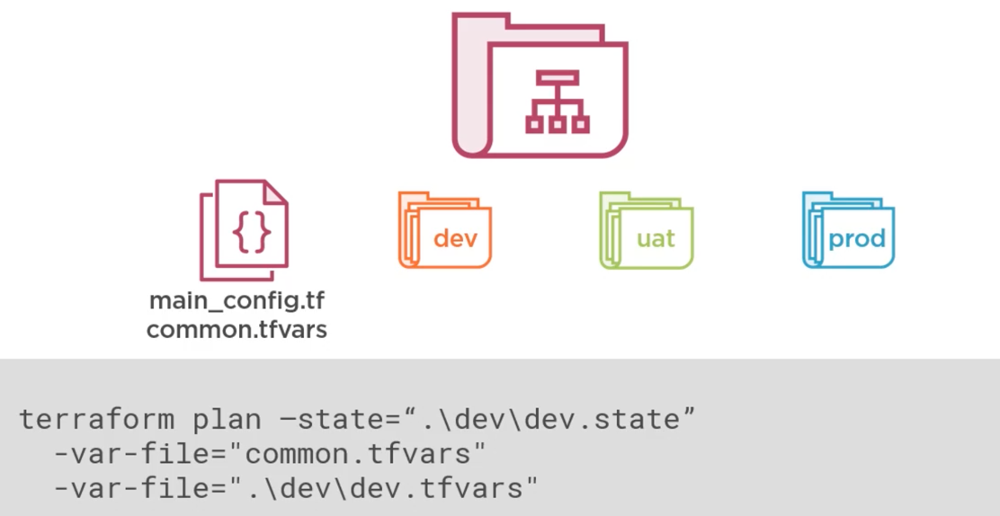

# Trabajar con entornos

Normalmente los entornos tedrán más cosas en común que cosas diferentes. Hay que tratar de reutilizar los componentes creados.

Para gestionar los entornos tenemos dos aproximaciones:

## Gestionarlos con carpetas

Colocamos todos los ficheros de configuración en la mismna carpeta y luego creamos una carpeta para cada entorno.



## Usar Workspaces

Colocamos todos los ficheros de configuración en la mismna carpeta y terraform, por medio de los workspaces, hace el trabajo de mantener los estados. Por defecto siempre se trbaja en el workspace **default**. El workspace *default* no se puede eliminar.

Comandos de Workspace

|Comando|Descripción|
|---|---|
|show|Muestra el workspace que estamos usando|
|list|Lista los workspaces|
|select|Selecciona el workspace a usar|
|new|Crea un nuevo workspace y lo pone en uso|
|delete|Eliminar un workspace|

```terraform
# Entorno de desarrollo
terraform workspace new dev
terraform plan -out dev.tfplan
terraform apply "dev.tfplan"

# Entorno de producción
terraform workspace new prod
terraform plan -out prod.tfplan
terraform apply "prod.tfplan"
```

Para utilizar las variables según el *workspace* que estemos por medio de los nombres de la variables.

```terraform
locals {
    env_name = lower(terraform.workspace)  # La variable contendrá el nombre del workspace que estemos usando

    common_tags = {
        Var1 = var.var1
        Environment = local.env_name
    }

    s3_bucket_name = "${local.env_name}-bxbxbxbxb"
}

## En los recursos

resource "aws_vpc" "vpc" {
    cidr_block = var.network_address_space[terraform.workspace]
}

resource "aws_vpc" "vpc" {
    count = var.subnet_count[terraform.workspace]
}
```
