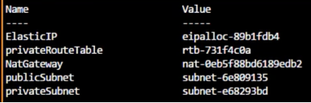

# Importar recursos ya creados

Terraform no importa automáticamente nada. Lo que se debe hacer es crear **manualmente** la configuración que se quiere importar.

Valores para un ejemplo

.

Sintaxis del comando:
> terraform import [options] ADDR ID

|Parámetro|Descripción|
|---|---|
|ADDR|Terraform config resource identifier|
|ID|Provider specific resource identifier|

```terraform
terraform import --var-file="xxxx.tfvars" module.vpc.aws_subnet.private[2] subnet-e68293bd
terraform import --var-file="xxxx.tfvars" module.vpc.aws_eip.nat[2] eipalloc-89b1fdb4
```
