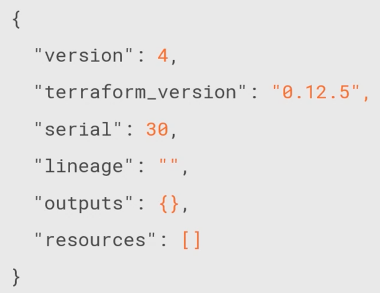

# El fichero de estado de terraform

EL fichero de estados que genera terraform.

* Fichero en formato *JSON*. **No se debe de tocar!!!**. Los cambios se hacen con terraform.
* Contiene los *resource mappings* y *metadata*.
* Locking. Para indicar que alguien está trabajando en la infraestructura y no se debería cambiar nada ahora mismo.
* Location. El fichero por defecto se almacena donde mismo ejecutamos el proceso. Se puede almacenar en un sitio centralizado.
  * Local
  * AWS, NFS u otros
* Workspaces. Cada workspace tiene su fichero de estado. Se pueden hacer cambios de *workspace*

## Que contiene

